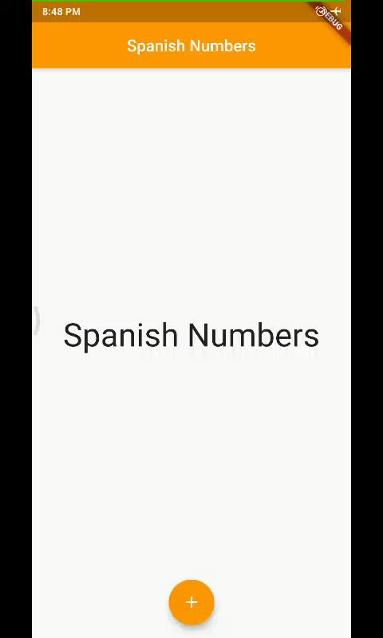

# Spanish Numbers

## A simple app which prints Spanish numbers from 1(uno) to 10(dietz) on pressing a button.

-----

Run any Flutter repository on Zapp website: <a href="https://zapp.run/assets/homepage/import-github.gif">refer this link </a>

List of all Flutter apps: <a href="https://github.com/Rahullkumr/Flutter-Projects-List">click here</a>
