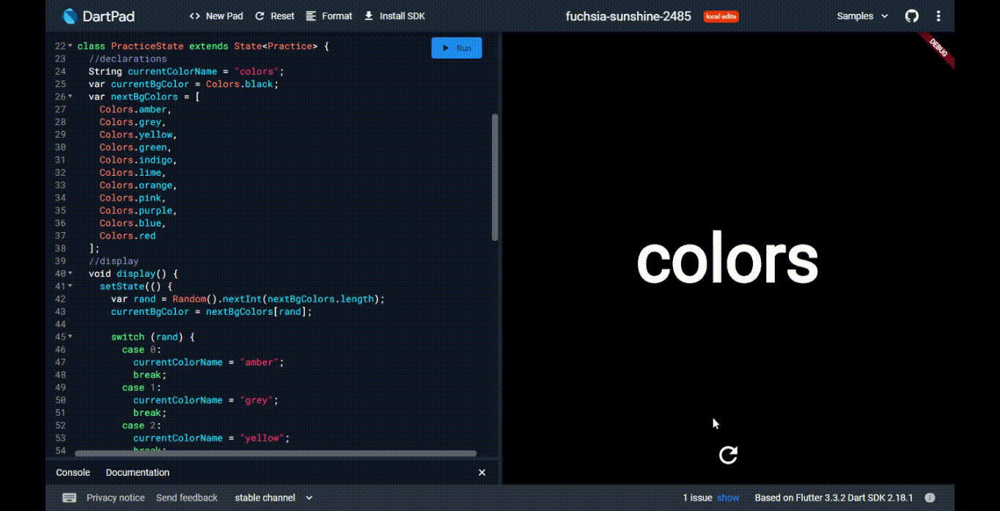

# Background Color changer APP
## There is a floating action button which changes color on pressed
## run ==> https://dartpad.dev/?id=03a45a66e3895bdcc3d68f7613ef0adb

-----

Run any Flutter repository on Zapp website: <a href="https://zapp.run/assets/homepage/import-github.gif">refer this link </a>

List of all Flutter apps: <a href="https://github.com/Rahullkumr/Flutter-Projects-List">click here</a>
